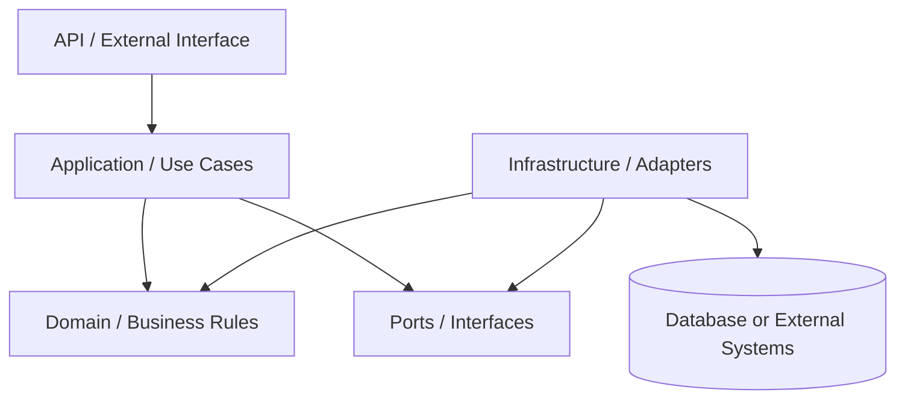
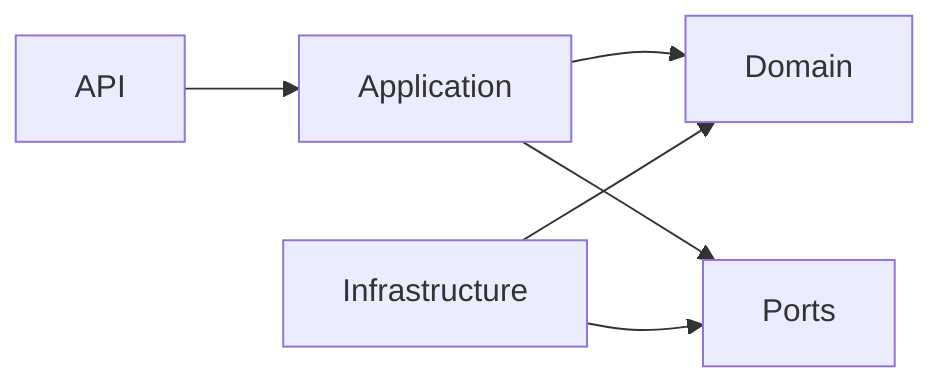
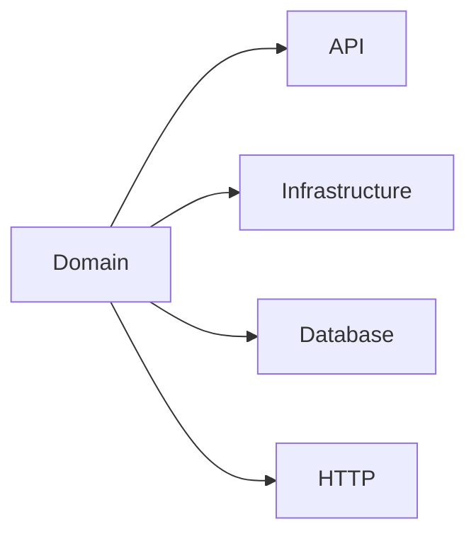

# Backend Architecture

## Goal

The backend architecture must separate external interfaces, application orchestration, business rules and infrastructure details.

The exact package names may vary by project, but the responsibilities must remain clear.

## Recommended Layers

The recommended architecture has four conceptual areas:

- API
- Application
- Domain
- Infrastructure



## API Layer

Responsible for:

- receiving external requests
- validating request shape
- converting input into application commands or requests
- returning responses
- HTTP status mapping
- API documentation

Must avoid:

- business rules
- persistence logic
- complex orchestration
- direct database access
- large object construction

Examples of API concerns:

- controllers
- request DTOs
- response DTOs
- OpenAPI documentation
- exception handlers

### OpenAPI contracts (`*API`) and feature packages

- Prefer **public interfaces** named `*API` that declare REST paths and carry **OpenAPI** annotations (`@Tag`, `@Operation` with summary and multiline description, `@ApiResponses` / `@ApiResponse`). Documentation strings must be **Portuguese**, in the agreed rich style (rule lists where helpful, HTTP status descriptions in Portuguese).
- Controllers **`implements`** the feature `*API` interface; avoid duplicating Swagger annotations on the class when they already live on the interface.
- **Standard error responses in OpenAPI:** apply `@StandardErrorApiResponses` (`com.agenciahub.api.api.docs`) at the `*API` type (and optionally per method) so 400/401/403/404/409/500 are documented with the shared **`ApiError`** schema. Rationale and HTTP/`code` policy: **ADR 0003** (`docs/architecture/adr/0003-api-errors-openapi-tenant-security.md`).
- **Target package layout** (incremental; same structural idea as grouping by feature in a reference project): `com.agenciahub.api.controller.<feature>.docs` for `*API`, and `com.agenciahub.api.controller.<feature>` for the `@RestController`. Pair with use cases under `com.agenciahub.api.application.<feature>`. Avoid mass-moving unrelated controllers outside an explicit roadmap step. **Why `controller` is not under `application`:** the conceptual API layer maps to the `controller` Java package by deliberate choice — see **ADR 0004** (`docs/architecture/adr/0004-java-packages-vs-conceptual-layers.md`).
- **Global HTTP error mapping:** `GlobalExceptionHandler` lives in `com.agenciahub.api.web` (not under `controller`). Tenant and security resolution patterns (`TenantContext.requireAgencyId`, `SecurityContextUsers`, `UnauthenticatedException`, `MissingAgencyContextException`) are part of the same contract; see **ADR 0003**.

### Application-facing error messages

- **Exception message strings** meant for logs, API error bodies, or operators: **Portuguese** and **lowercase** narrative text (UUIDs and similar tokens keep their usual spelling). When editing a file, align existing English messages in that flow to this convention where practical.

## Application Layer

Responsible for:

- use cases
- workflow orchestration
- transaction boundaries
- calling domain behavior
- coordinating repositories, gateways or external ports

Must avoid:

- owning domain rules
- framework-specific persistence details
- large mapping blocks
- duplicated validation already protected by the domain

Examples of application concerns:

- create use case
- update use case
- approve use case
- cancel use case
- query service when appropriate
- application commands
- application responses

### Use case contracts (this project)

In `com.agenciahub.api.application` the codebase exposes two generic shapes:

- **`UseCase<I, O>`** — one input, one output (`execute` returns `O`).
- **`VoidUseCase<I>`** — one input, no return value (`execute` is `void`); use when the operation only coordinates side effects (notifications, deletes without payload, etc.).

**Recommended style for new use cases (when the operation is non-trivial):**

1. Define a **dedicated interface** that extends the generic contract, so callers depend on a stable operation name:
   - Example: `UpdateBookingUseCase extends UseCase<UpdateBookingRequest, UpdateBookingResponse>` (names are illustrative; use this project’s vocabulary).
2. Implement it in a **`@Service`** class whose name reflects the action **without** a redundant `Impl` suffix:
   - Example: `UpdateBooking implements UpdateBookingUseCase` (not `UpdateBookingUseCaseImpl`).

A **single class** that implements `UseCase<I, O>` directly (e.g. `ListBookingsUseCase`) is still acceptable for small pilots or very thin operations; move to the interface + implementation split when the class accumulates collaborators or mapping logic.

**Logging:** implementations may use `@Slf4j` and `log.info` at clear boundaries (for example, start of `execute` with a correlation or entity id, and a single success line). Keep volume reasonable—avoid logging inside tight loops or for every trivial step.

Do **not** copy class or package names from external sample repositories; only the **shape** (interface + implementing service + logging discipline) is prescriptive.

**Refactoring definitions (packages + class roles, target vs legacy `*Service`):** see `docs/architecture/05-package-refactoring-and-class-responsibilities.md`.

## Domain Layer

Responsible for:

- business rules
- entities
- value objects
- state transitions
- business invariants
- domain validations
- domain events when needed
- repository or gateway interfaces when following ports/adapters

Must avoid depending on:

- HTTP
- controllers
- database
- JPA
- Spring-specific annotations
- external APIs
- infrastructure implementations

## Infrastructure Layer

Responsible for:

- persistence implementation
- database entities
- external API clients
- message brokers
- file storage
- framework-specific configuration
- implementation of domain/application ports
- mapping between persistence/external models and internal models

Must avoid:

- owning business rules
- leaking infrastructure models into the domain
- exposing database entities directly as API responses

## Dependency Direction

Allowed:



Not allowed:



## Suggested Package Structure

This is a generic suggestion. Adapt names to the project context.

```txt
src/main/java/<base-package>/
  api/
    <feature>/
      request/
      response/

  application/
    <feature>/
      usecase/
      command/
      result/

  domain/
    <feature>/
      valueobject/
      event/

  infrastructure/
    persistence/
      <feature>/
    integration/
      <external-system>/

  common/
    exception/
    validation/
    time/
    mapper/
```

## Important Note

This structure is not mandatory as a literal folder template.

The mandatory part is the separation of responsibilities.

If the current project already has a strong convention, prefer gradual adaptation instead of a disruptive rename.