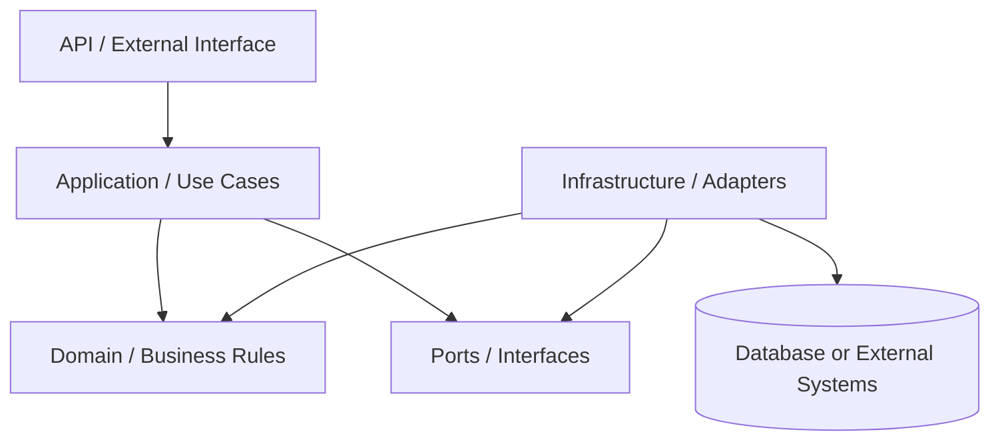
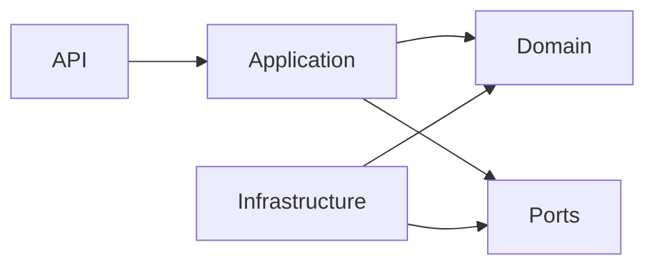
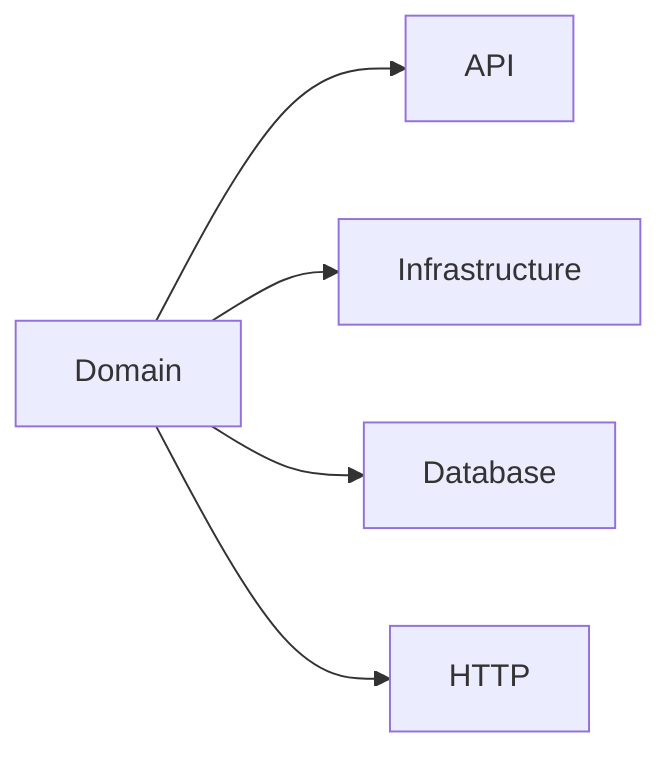

# Backend Architecture

## Goal

The backend architecture must separate external interfaces, application orchestration, business rules and infrastructure details.

The exact package names may vary by project, but the responsibilities must remain clear.

## Recommended Layers

The recommended architecture has four conceptual areas:

- API
- Application
- Domain
- Infrastructure



## API Layer

Responsible for:

- receiving external requests
- validating request shape
- converting input into application commands or requests
- returning responses
- HTTP status mapping
- API documentation

Must avoid:

- business rules
- persistence logic
- complex orchestration
- direct database access
- large object construction

Examples of API concerns:

- controllers
- request DTOs
- response DTOs
- OpenAPI documentation
- exception handlers

## Application Layer

Responsible for:

- use cases
- workflow orchestration
- transaction boundaries
- calling domain behavior
- coordinating repositories, gateways or external ports

Must avoid:

- owning domain rules
- framework-specific persistence details
- large mapping blocks
- duplicated validation already protected by the domain

Examples of application concerns:

- create use case
- update use case
- approve use case
- cancel use case
- query service when appropriate
- application commands
- application responses

## Domain Layer

Responsible for:

- business rules
- entities
- value objects
- state transitions
- business invariants
- domain validations
- domain events when needed
- repository or gateway interfaces when following ports/adapters

Must avoid depending on:

- HTTP
- controllers
- database
- JPA
- Spring-specific annotations
- external APIs
- infrastructure implementations

## Infrastructure Layer

Responsible for:

- persistence implementation
- database entities
- external API clients
- message brokers
- file storage
- framework-specific configuration
- implementation of domain/application ports
- mapping between persistence/external models and internal models

Must avoid:

- owning business rules
- leaking infrastructure models into the domain
- exposing database entities directly as API responses

## Dependency Direction

Allowed:



Not allowed:



## Suggested Package Structure

This is a generic suggestion. Adapt names to the project context.

```txt
src/main/java/<base-package>/
  api/
    <feature>/
      request/
      response/

  application/
    <feature>/
      usecase/
      command/
      result/

  domain/
    <feature>/
      valueobject/
      event/

  infrastructure/
    persistence/
      <feature>/
    integration/
      <external-system>/

  common/
    exception/
    validation/
    time/
    mapper/
```

## Important Note

This structure is not mandatory as a literal folder template.

The mandatory part is the separation of responsibilities.

If the current project already has a strong convention, prefer gradual adaptation instead of a disruptive rename.