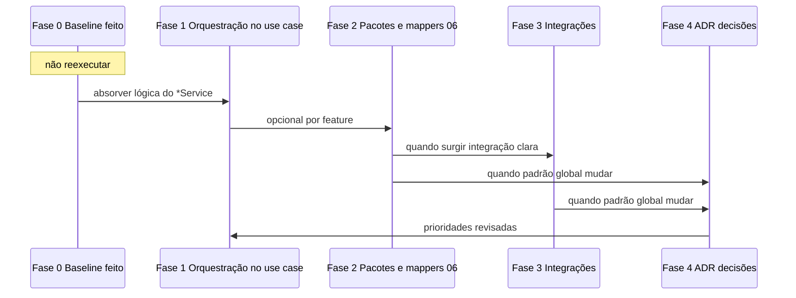

# Roadmap de refatoração incremental (backend)

Este documento define a **sequência a executar a partir de agora**, alinhada a **`02-backend-architecture.md`**, **`05-package-refactoring-and-class-responsibilities.md`** e **`06-clean-architecture-use-case-driven.md`**. O trabalho já feito no repositório conta como **Fase 0 (baseline)** — **não** deve ser repetido como checklist obrigatório.

**Princípios (sempre válidos):**

- Um passo por PR quando possível; `mvn test` verde antes de merge.
- Novo padrão só vira convenção depois de **um** piloto bem feito e revisado.
- Contrato HTTP só muda com acordo explícito (produto + API).

---

## Fase 0 — Baseline já entregue **(não reexecutar)**

Estado consolidado no `agencia-hub-api` (referência histórica; novos fluxos partem daqui):

- **Documentação:** `01`–`03`, **`05`**, **`06`**, `02` alinhado; **ADR 0003** (erros, OpenAPI, tenant/segurança), **ADR 0004** (pacotes `controller` / `application`); `.cursor/rules.md`.
- **Apresentação HTTP:** `*API` em `com.agenciahub.api.application.controllers.docs`; `@RestController` em `controller.<feature>`; `@StandardErrorApiResponses` em todos os `*API`; `GlobalExceptionHandler` em `web`.
- **Aplicação (primeira onda):** casos de uso em `application.<feature>` com interfaces `UseCase` / `VoidUseCase`, muitas operações ainda **delegando** a `*Service`; `*ResponseMapper` onde extraído; controllers finos; mensagens de erro em português/minúsculas nos fluxos alinhados; `SecurityContextUsers`, `TenantContext`, testes de controller (`WebMvcControllerTestImports`, `@MockitoBean` em filtros quando aplicável).

**Isto substitui** o antigo encadeamento “Passo 0 → … → Passo 4” para este repositório: **não** voltar a abrir PRs só para refazer baseline, piloto de cotação isolado ou mover `*API` para `controller.*.docs`.

---

## Visão em sequência (a partir da Fase 1)

---

## Fase 1 — Orquestração no caso de uso (absorver `*Service`)

**Objetivo:** A implementação `@Service` do **caso de uso** passa a conter a **orquestração** (repositórios, políticas de fluxo, chamadas a outros use cases); o `*Service` monolítico encolhe ou desaparece por operação — alinhado ao **06** (use case linear; sem regra de negócio pesada no controller) e ao **05** §4.4.

**Inclui (checklist por PR / por operação):**

- [x] Escolher um método ou um conjunto coeso num `*Service` (evitar auth completo num único PR).
- [x] Mover orquestração para `Xxx implements XxxUseCase` (ou criar use case se ainda for só delegação de uma linha **com** plano de absorção no mesmo PR ou no seguinte).
- [x] Manter DTOs HTTP e contrato REST; ajustar apenas o wiring (controller → use case).
- [x] `@Transactional` só onde for estritamente necessário (**05** §4.3); justificar no PR se mantiver/adicionar.
- [x] `mvn test` verde.

**Pronto quando:** O fluxo tocado não depende do `*Service` para essa operação. **Concluído neste repo:** pacote `com.agenciahub.api.service` **eliminado**; restantes auxiliares em `integrations`, `usecases.user` e `scheduling` (**ADR 0006**).

**Depois:** Continuar Fase 1 noutra operação/agregado **ou** iniciar Fase 2 numa feature onde o pacote `application.<feature>` ficou grande.

**Evitar:** Dois beans como fonte de verdade para a mesma operação (`CreateXxx` + `XxxService.create` sem plano de remoção).

---

## Fase 2 — Pacotes e mappers alinhados ao **06** (opcional por feature)

**Objetivo:** Aproximar a árvore de código do pacote-alvo do **06**: `application/usecases/{feature}/{action}/` com `{Action}UseCase`, `{Action}`, DTOs de entrada/saída da operação e, **quando existir integração ou mapeamento não trivial**, `InputMapper` / `OutputMapper` estáticos.

**Inclui (checklist):**

- [x] Migrar **uma feature** de cada vez (Convenção B no **05** §5.2); atualizar imports; `mvn test` verde. **Concluído:** todas as features HTTP em `usecases/...`.
- [x] Não obrigar rename de `dto.*` globais no mesmo PR (podem coexistir com DTOs colocados na pasta da operação).

**Pronto quando:** Pelo menos uma feature piloto está na estrutura `usecases/...` (**todas** as features HTTP migradas para `application/usecases/{feature}/{ação}/`).

**Depois:** Fase 1 nas features recém-reorganizadas (se ainda houver lógica no serviço) **ou** Fase 3 se integrações externas forem o gargalo.

**Evitar:** Big-bang mover todas as features sem piloto.

---

## Fase 3 — Integrações explícitas

**Objetivo:** Outbound HTTP, filas, terceiros, etc. em `application/integrations/{service}/` com interface + implementação, como no **06** — em vez de lógica “escondida” em `service` genérico.

**Inclui (checklist):**

- [x] Identificar um adaptador (ex.: e-mail, cliente REST). **Piloto: e-mail.**
- [x] Introduzir interface + implementação; injetar no use case; testes com duplo de teste ou cliente fake quando fizer sentido.

**Pronto quando:** O use case não chama diretamente detalhes de framework de integração espalhados; contrato da porta está claro. **E-mail:** `application.integrations.email` (**ADR 0005**). **Códigos:** `application.integrations.verification` (**ADR 0006**).

**Depois:** Fase 1 noutros fluxos que reutilizem a integração **ou** Fase 4 se a política de erros/retry for transversal.

---

## Fase 4 — Decisões transversais (ADR + docs)

**Objetivo:** Quando algo vira **regra do projeto** (novo pacote raiz, split domínio/JPA em larga escala, política transversal de erros/retry), ficar explícito.

**Inclui (checklist):**

- [x] Novo **ADR** (e-mail em `integrations`) + atualização pontual de `04` conforme o caso.
- [ ] Itens grandes que **não** entram sem ADR (já fora do roadmap operacional): separação JPA vs entidade de domínio em **toda** a base; reescrita completa de `AuthService` / segurança; rename em massa de pacotes.

**Pronto quando:** Leitor novo sabe o que mudou e porquê.

**Depois:** Voltar à **Fase 1** (ou 2) com prioridades revisadas.

---

## Referência rápida: “terminei a fase N, e agora?”

| Fase concluída | Próxima ação típica |
|----------------|---------------------|
| 0 | **Não aplicável** — baseline já feito neste repo. |
| 1 (um PR) | Continuar **Fase 1** noutra operação **ou** **Fase 2** se a feature estiver madura para reorganizar pacotes. |
| 2 | **Fase 1** nas operações da feature reorganizada **ou** **Fase 3** se integrações forem o foco. |
| 3 | **Fase 1** em consumidores **ou** **Fase 4** se houver decisão global. |
| 4 | **Fase 1** (prioridade revisada). |

---

## Repositório novo (“greenfield”) neste mono/modelo

Se um módulo **não** tiver o histórico deste repo: antes da Fase 1, garantir **Fase 0 mínima** (docs de arquitetura, `mvn test` + CI, primeiro fluxo com `*API` + controller + um use case). O detalhe equivale ao antigo “Passo 0–1 + piloto” descrito no **06** e no **05**.

---

## Histórico de entregas (referência — não checklist)

*(Consolidado de entregas anteriores; mantém contexto para PRs e auditoria.)*

- Cotações, clientes, agência, convites, solicitação (pública + agência), termos, utilizadores, painel vendedor, auth: padrão `*API` + controller + `application.<feature>` + mappers onde aplicável, muitas rotas ainda com use case a delegar em `*Service`.
- **Financeiro (`/financial-entries`):** Fase 1 — orquestração absorvida nos use cases; **`FinancialEntryService` removido.**
- **Termos (`TermsConstants` + use cases):** Fase 1 — **`TermsService` removido**; registo de agência usa `TermsConstants` no use case `RegisterAgency`. **Fase 2 (piloto):** pacotes `application/usecases/terms/...` por acção (**06**).
- **Auth (credenciais / registo / códigos):** Fase 1 — **`AuthService` removido**; orquestração em `application.usecases.auth.*` + `AuthBetaWhitelist` (e-mails beta).
- **Agência:** Fase 1 — **`AgencyService` removido**; `GetAgency` / `UpdateAgency` orquestram repositório + auditoria.
- **Solicitação (config + submissões):** Fase 1 — **`SolicitacaoConfigService` e `SolicitacaoSubmissionService` removidos**; use cases + `SolicitacaoConfigSupport` (defaults/mapeamento).
- **Convites:** Fase 1 — **`InvitationService` removido**; `InvitationTokenPolicy`, `InvitationLinkBuilder`; `RegisterViaInvite` valida convite no use case.
- **Clientes:** Fase 1 — **`CustomerService` removido**; `CustomerResponseMapper` + `CustomerPhoneNormalizer`; CRUD/listagem/lookup nos use cases.
- **Cotações + painel vendedor:** Fase 1 — **`QuotationService` removido**; use cases + `QuotationSupport`; `BuildSellerDashboard` usa `ListQuotationsUseCase`.
- **Utilizadores:** Fase 1 — **`UserService` removido**; `GetUserEntityById` para painel vendedor (owner); CRUD/listagens nos use cases.
- **Fase 2 (pacotes 06):** todas as features HTTP migradas para `application/usecases/{feature}/{ação}/` (além do piloto **termos** já feito).
- **Fase 3 (integrações):** e-mail em `application/integrations/email` — ver **ADR 0005**.
- **Fase 4 (ADR):** **ADR 0005** (e-mail), **ADR 0006** (verificação, link público, scheduling).
- **Refatoração incremental concluída:** sem `com.agenciahub.api.service`; HTTP em `usecases/...`; integrações em `integrations/...`.
- **ADR 0007 (pacotes HTTP):** `@RestController` + `*API` em `application.controller` (plano) + `application.controller.doc` — **concluído**.
- **ADR 0008 (piloto customer):** DTOs em `usecases.customer.*` (`CreateCustomerRequestDTO`, `CustomerSummaryResponseDTO` em `shared`); pacotes `create`, `retrieve.byid|list`, `update`, `delete`, `lookup`; `dto/customer` removido.
- **ADR 0008 (agentes):** `CreateUser` rejeita `UserRole.SELLER` — agente só via convite + `register-invite`.
- **Próximo:** **ADR 0008** — restantes features (`dto/*`), `AccountKind` / `salesagent`, renomes `PlatformAccount`.

Atualize esta lista **só** quando uma entrega mudar o baseline (ex.: “`CustomerService` removido por completo”) — não é obrigação a cada PR da Fase 1.
