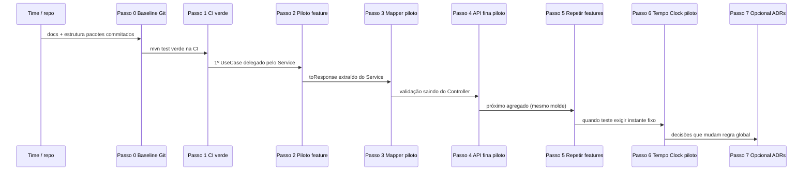

# Roadmap de refatoração incremental (backend)

Este documento é um **mapa de sequência**: ordem sugerida de trabalho, critério de pronto em cada passo e o que fazer **logo após** concluí-lo. Objetivo: evoluir em direção à arquitetura descrita em `02-backend-architecture.md` sem reescrita grande e sem esquecer dependências (CI, testes, documentação).

Princípios gerais (sempre válidos):

- Um passo por PR quando possível; PRs menores revisam melhor.
- Não mover tudo de uma vez; cada passo deve deixar o `main` verde (build + testes).
- Novo padrão só vira convenção depois de **um** fluxo piloto bem feito e revisado.

### Progresso consolidado (referência do repositório)

- **Cotações (`/quotations`):** `QuotationAPI` + `QuotationController` em `controller.quotation`; casos de uso em `application.quotation` delegando ao `QuotationService`; `QuotationResponseMapper` extrai `toResponse`; exclusão **permanente**; endpoints `/trash` removidos; mensagens de exceção do fluxo em português/minúsculas onde alinhado.
- **Clientes (`/customers`):** `CustomerAPI` + `CustomerController` em `controller.customer`; casos de uso em `application.customer` delegando ao `CustomerService` (mesmo contrato HTTP).
- **Agência (`/agency`):** validação de telefone no patch em `AgencyService.update`; `AgencyAPI` + `AgencyController` em `controller.agency`; `GetAgency` / `UpdateAgency` + `AgencyResponseMapper` em `application.agency`; remoção de `AgencyService.getCurrentAgency()` (tenant + `getById` no caso de uso).
- **Financeiro / usuários (parcial):** `FinancialEntryService` e `UserService` — mensagens `ResourceNotFoundException` em inglês substituídas por equivalentes em português/minúsculas nos pontos encontrados.
- **Lançamentos financeiros (`/financial-entries`):** `FinancialEntryAPI` + `FinancialEntryController` em `controller.financial`; casos de uso em `application.financial` delegando ao `FinancialEntryService`; `FinancialEntryResponseMapper` extrai `toResponse`.
- **Convites (`/invitations`):** `InvitationAPI` + `InvitationController` em `controller.invitation`; casos de uso em `application.invitation` delegando ao `InvitationService`; `InvitationResponseMapper` (URL via `buildInviteUrl`); mensagens de exceção do serviço alinhadas a português/minúsculas onde aplicável.
- **Solicitação pública / submissões / config agência:** formulário público e config por slug em `controller.solicitacao.pub`; submissões e **config autenticada** (`/agency/solicitacao-config`) em `controller.solicitacao.agency` — `SolicitacaoSubmissionAgencyAPI`, `SolicitacaoConfigAgencyAPI`, controllers finos; casos de uso em `application.solicitacao`; `SolicitacaoSubmissionResponseMapper`; serviços de submissão e de config recebem **`agencyId` explícito** onde aplicável; `SolicitacaoConfigService` sem `TenantContext` nos métodos de agência.

- **Termos:** `TermsAPI` + `TermsController` em `controller.terms` (paths absolutos nos métodos: um único contrato evita falha de registro de mapeamento ao implementar várias interfaces); `GetLatestTermsPublic` / `AcceptTerms` em `application.terms`; `TermsService`; DTO `AcceptTermsRequest` em `dto.terms`; mensagens alinhadas a minúsculas onde aplicável.

**Próxima fila sugerida (Passo 5):** `UserController`, `SellerDashboardController`, `AuthController` no mesmo molde conforme prioridade; revisão de dead code após estabilizar pacotes.

---

## Visão em sequência (diagrama)

---

## Passo 0 — Baseline no repositório e estrutura mínima

**Objetivo:** Tudo que define “como vamos trabalhar” e os ganchos de pacote estiverem **commitados** e conhecidos pelo time.

**Inclui (checklist):**

- [ ] `docs/architecture/*` e `docs/architecture/adr/*` no Git (se ainda forem só locais).
- [ ] `.cursor/rules.md` no Git (se aplicável ao time).
- [ ] Pacotes de apoio já acordados: `com.agenciahub.api.application` (ex.: `UseCase`), `com.agenciahub.api.api`, `com.agenciahub.api.infrastructure` (apenas `package-info` até haver classes).

**Pronto quando:** `git status` limpo no que diz respeito a baseline; outra pessoa clona e vê a mesma estrutura.

**Depois deste passo, fazer:** Passo 1 (não iniciar UseCase em feature antes da CI estar confiável).

**Evitar:** Começar a mover controllers ou renomear pacotes em massa.

---

## Passo 1 — Build e testes confiáveis (`mvn test` verde)

**Objetivo:** Nenhum passo seguinte pode apoiar-se em suíte quebrada.

**Inclui (checklist):**

- [ ] Rodar `mvn test` localmente; corrigir **falhas de contexto** em testes (ex.: `@WebMvcTest` + filtros JWT sem beans necessários).
- [ ] Garantir o mesmo na CI (GitHub Actions ou equivalente).

**Neste repositório (`agencia-hub-api`):** em `@WebMvcTest`, importar `com.agenciahub.api.support.WebMvcControllerTestImports`, anotar `@AutoConfigureMockMvc(addFilters = false)` e registrar `@MockitoBean` para `JwtAuthFilter` e `RateLimitFilter`, para o slice não precisar de `JwtService` real. Reutilize o mesmo padrão ao adicionar novos testes de controller.

**Pronto quando:** `mvn test` verde no `main` (ou na branch de integração que vocês usam).

**Depois deste passo, fazer:** Passo 2 — escolher **uma** feature piloto (sugestão: CRUD de **cotação** — pouco acoplamento a auth).

**Evitar:** Misturar correção de teste com refator grande de domínio no mesmo PR.

---

## Passo 2 — Primeiro caso de uso (piloto) sem mudar API HTTP

**Objetivo:** Ter **um** fluxo onde o `*Service` delega a interfaces de caso de uso (`XxxUseCase`) implementadas por `@Service` (`Xxx`), mantendo endpoints e DTOs iguais.

**Inclui (checklist):**

- [ ] Escolher um fluxo pequeno (ex.: criar/atualizar/listar **cotação**).
- [ ] Criar interfaces `XxxUseCase extends UseCase<…>` (ou `VoidUseCase`) e `@Service` `Xxx implements XxxUseCase` em `com.agenciahub.api.application.<feature>`, mais DTOs de comando/resultado **se** fizer sentido; alinhar com `02-backend-architecture.md`, secção *Use case contracts*.
- [ ] O `@Service` público vira fachada: chama o use case e retorna o mesmo DTO de resposta de antes.

**Pronto quando:** Testes do piloto verdes; contrato REST inalterado (mesmos paths, status, shape de JSON).

**Depois deste passo, fazer:** Passo 3 no **mesmo** piloto (extrair mapeamento para um `*ResponseMapper` dedicado); em seguida Passo 4 (controller fino) ou Passo 5 conforme prioridade.

**Evitar:** Piloto em `AuthService`, segurança ou fluxo com muitas integrações na primeira rodada.

---

## Passo 3 — Mapper dedicado no piloto

**Objetivo:** Reduzir `toResponse` / builders grandes dentro do serviço ou use case.

**Inclui (checklist):**

- [ ] Classe dedicada (ex.: `QuotationResponseMapper`) com métodos nomeados (`toResponse`, etc.) no escopo do piloto.
- [ ] Serviço/use case só orquestra e chama o mapper.

**Pronto quando:** Comportamento e testes iguais; método privado gigante de mapeamento sumiu ou ficou trivial.

**Depois deste passo, fazer:** Passo 4 no **mesmo** piloto (controller fino).

**Evitar:** Criar “framework de mapper” genérico antes de ter 2–3 exemplos reais.

---

## Passo 4 — Controller apenas adaptador no piloto

**Objetivo:** Nenhuma regra de negócio nem validação de domínio no controller do piloto; contrato HTTP e OpenAPI explícitos.

**Inclui (checklist):**

- [ ] Mover validações que não são só “formato HTTP/Bean Validation” para o serviço/use case.
- [ ] Controller: `@Valid`, parâmetros, delegação, resposta.
- [ ] Extrair documentação OpenAPI para interface pública `*API` no subpacote `docs` da feature (ex.: `controller.quotation.docs.QuotationAPI`); o `@RestController` implementa essa interface (ver `.cursor/rules.md`).
- [ ] Mensagens de exceção no fluxo tocado: **português** e **minúsculas** (ver `02-backend-architecture.md` e `.cursor/rules.md`).
- [ ] (Opcional neste passo) Repetir o **agrupamento por feature** em outros controllers (`controller.<feature>`, `application.<feature>`), um agregado por PR.

**Pronto quando:** Controller do piloto sem `if` de regra de negócio; testes verdes.

**Depois deste passo, fazer:** Passo 5 — **replicar o molde** em outra feature (segundo PR), não expandir o piloto indefinidamente.

**Evitar:** Tocar em `SecurityConfig` / filtros só por alinhamento estético.

---

## Passo 5 — Repetir o molde feature a feature

**Objetivo:** Crescimento sustentável: cada feature escolhe quando “entrar” no padrão.

**Inclui (checklist):**

- [ ] Lista priorizada de módulos (ex.: cliente → cotação → solicitação pública → financeiro).
- [ ] Para cada item: UseCase (se ganho claro) → mapper → controller fino.
- [ ] Só mergear com testes verdes.

**Pronto quando:** Pelo menos **duas** features usam o mesmo padrão (piloto +1); time alinha nomes de pacotes por feature (`application.quotation`, `application.customer`, etc.) se desejado.

**Depois deste passo, fazer:** Avaliar Passo 6 quando surgir necessidade real de testes com tempo fixo.

**Evitar:** Exigir que **todas** as classes antigas migrem antes de seguir.

---

## Passo 6 — Tempo (`Clock`) só onde a regra precisa

**Objetivo:** Testes determinísticos para expiração, trial, auditoria, etc.

**Inclui (checklist):**

- [ ] Introduzir `Clock` (ou serviço de tempo) **no fluxo** que vocês forem testar com instante fixo.
- [ ] Testes com `Clock.fixed(…)` ou override de bean em `@SpringBootTest` / test slice acordado.

**Pronto quando:** Pelo menos um fluxo crítico deixa de usar `Instant.now()` direto **na parte testada**; testes não dependem do relógio real.

**Depois deste passo, fazer:** Repetir apenas em outros fluxos com a mesma dor; opcionalmente um `@Bean Clock` global (ADR se virar padrão).

**Evitar:** `Clock` em toda a base sem necessidade (como já combinado).

---

## Passo 7 — Documentação de decisões (quando o padrão mudar de verdade)

**Objetivo:** O que virou **regra do projeto** fica explícito.

**Inclui (checklist):**

- [ ] Atualizar `01-architecture-principles.md` / `02-backend-architecture.md` só quando um limite real mudar (ex.: “controllers vivem em `api`”).
- [ ] Novo ADR quando houver escolha relevante (ex.: pacote por feature, política de exceções, uso obrigatório de `Clock` em serviços X).

**Pronto quando:** Novo desenvolvedor (ou agente) lê os docs e sabe onde colocar código novo.

**Depois deste passo, fazer:** Volta ao Passo 5 com prioridade revisada.

---

## Referência rápida: “terminei o passo N, e agora?”

| Passo concluído | Próxima ação obrigatória |
|-----------------|-------------------------|
| 0 | 1 — deixar `mvn test` verde |
| 1 | 2 — primeiro `UseCase` piloto |
| 2 | 3 — mapper no mesmo piloto |
| 3 | 4 — controller fino no mesmo piloto |
| 4 | 5 — repetir em outra feature |
| 5 | Continuar 5 até fila acabar ou prioridade mudar; então 6 se precisar |
| 6 | 5 ou 7 conforme surgir padrão global |
| 7 | 5 com convenções atualizadas |

---

## O que fica **fora** deste roadmap inicial (propositalmente)

- Separação completa entidade JPA vs entidade de domínio em **toda** a base (grande; fazer só se houver ADR e piloto).
- Reescrita de `AuthService` / segurança sem projeto de testes dedicado.
- Rename em massa de pacotes (`service` → `application`) sem necessidade operacional.

Quando um destes itens virar necessidade de negócio ou manutenção, abra um **ADR** e insira um novo “Passo X” entre 5 e 7 com escopo explícito.
