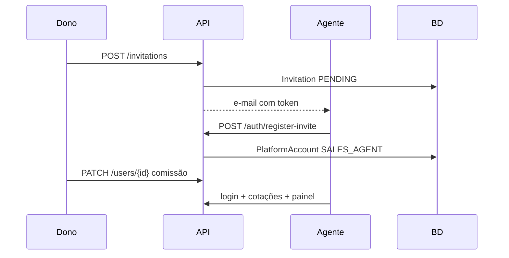

# ADR 0008 — DTOs por operação, identidade de plataforma e CRM Customer

## Status

**Aceita** — migração concluída (DTO colocation, `AccountKind`, `PlatformAccount` / `CrmCustomer`, `salesagent`).

## Contexto

1. **`com.agenciahub.api.dto`** concentra DTOs partilhados por feature, longe dos use cases que os consomem — dificulta ver o contrato de **uma** operação.
2. Pacotes de use case usam nomes concatenados (`createcustomer`, `getcustomerbyid`) em vez de verbos (`create`, `retrieve.byid`).
3. **“Customer”** no produto tem dois significados que não devem misturar-se:
   - **CRM Customer** — cliente/lead da agência (`entity.Customer`, tabela `customers`).
   - **Conta de plataforma** — quem faz login (`entity.User`, tabela `users`, hoje `UserRole` OWNER/SELLER).
4. **Vendedor** (`SELLER`) está espalhado em `usecases.user`, `usecases.sellerdashboard`, `dto/seller`, sem bounded context claro.
5. O produto prevê **vários agentes de venda por agência**, com impacto em **precificação** (1 agente = preço X, N agentes = preço proporcional) — o modelo de domínio deve contar agentes por agência sem limitar a um só.

Complementa **ADR 0007** (controllers planos em `application.controller` + `doc`).

## Decisão

### A. Eliminar pacote `dto` global

1. O pacote **`com.agenciahub.api.dto` deixa de existir** após migração.
2. Cada operação expõe tipos **no seu pacote de use case**:
   - `CreateCustomerRequestDTO`, `CreateCustomerResponseDTO` em `application.usecases.customer.create`
   - `GetCustomerByIdResponseDTO` em `application.usecases.customer.retrieve.byid`
3. Sufixo **`DTO`** obrigatório em tipos de entrada/saída HTTP da operação.
4. **Duplicação entre operações é aceitável**; extrair tipo partilhado só quando o **contrato JSON** for estável e idêntico (ex.: `customer.shared.CustomerSummaryDTO` — usar com parcimónia).
5. Controllers (`application.controller`) e interfaces OpenAPI (`application.controller.doc`) **importam** DTOs dos pacotes de use case — não de `dto.*`.

### B. Convenção de pacotes de use case

```
application.usecases.<boundedContext>.<verb>[.<subverb>]
```

Exemplos:

| Operação | Pacote |
|----------|--------|
| Criar cliente CRM | `usecases.customer.create` |
| Obter cliente por id | `usecases.customer.retrieve.byid` |
| Listar clientes | `usecases.customer.retrieve.list` |
| Convidar agente | `usecases.invitation.create` |
| Registo via convite (agente) | `usecases.auth.registerviainvite` |
| Listar agentes activos | `usecases.salesagent.retrieve.list` |

Migração: renomear pastas (`createcustomer` → `create`, etc.) sem alterar contratos REST na mesma PR quando possível.

### C. Três conceitos de domínio (regras de negócio)

#### C.1 CRM Customer (cliente da agência)

- Agregado **`CrmCustomer`** (evolução de `entity.Customer`; nome JPA/tabela pode manter `customers` na migração).
- Pertence a **uma** agência; **não** é conta de login por defeito.
- **Não** aparece em enums de conta (`AccountKind`).
- Use cases: **`application.usecases.customer.*`** apenas.

#### C.2 Platform account (conta com login)

- Agregado **`PlatformAccount`** (evolução de `entity.User`; tabela `users` pode manter-se).
- Sempre ligada a **exactamente uma** agência (excepto operador interno futuro).
- Autenticação: `usecases.auth.*`.
- Perfil na agência via **`AccountKind`** (substitui `UserRole`):

```java
package com.agenciahub.api.domain.enums;

public enum AccountKind {
    AGENCY_OWNER,
    SALES_AGENT
    // futuro: PLATFORM_OPERATOR
}
```

- **Não** usar `CUSTOMER` neste enum — colide com CRM Customer.

Perfil (evolução):

```java
package com.agenciahub.api.domain.user;

import com.agenciahub.api.domain.enums.AccountKind;

public interface AgencyMemberProfile {
    AccountKind kind();
}
```

`PlatformAccount` implementa `AgencyMemberProfile` (`kind()` → `accountKind`). Implementações futuras: `AgencyOwnerProfile`, `SalesAgentProfile` (comissão, `publicLinkCode`, etc.).

#### C.3 Agency owner (`AGENCY_OWNER`)

- Criado no **onboarding da agência** (`RegisterAgency` / fluxo equivalente).
- Pode convidar **um ou mais** agentes de venda.
- Gere configuração da agência, convites, membros, CRM, financeiro conforme permissões actuais de `OWNER`.

#### C.4 Sales agent (`SALES_AGENT`)

- **Vários por agência** — sem limite de negócio “só um”; a contagem alimenta **billing** (preço por quantidade de agentes activos).
- Conta **só é criada** via **convite** aceite (`Invitation` + `RegisterViaInvite`), não por registo público genérico. Comissão **depois**, na gestão (secção D.1).
- Cada agente: **uma** agência; cotações/dashboard restritos ao papel actual de `SELLER`.
- Use cases de negócio do vendedor: **`application.usecases.salesagent.*`** (migrar `listactivesellers`, `sellerdashboard`, etc.).
- Renomeação conceptual: `UserRole.SELLER` → `AccountKind.SALES_AGENT`.

#### C.5 Platform operator (futuro)

- Conta interna que gere todas as agências/utilizadores.
- `AccountKind.PLATFORM_OPERATOR` ou pacote dedicado; fora de `AgencyMemberProfile` até modelar.

### D. Como nasce cada tipo de conta

| Quem | Como entra no sistema | Use case / fluxo |
|------|------------------------|------------------|
| **Dono da agência** | Registo da agência (primeiro utilizador) | `auth.registeragency` |
| **Agente de venda** | Dono envia convite → agente aceita com token | `invitation.create` → `auth.registerviainvite` |
| **Dono adiciona outro dono?** | Não previsto no modelo actual | — |
| **CRM Customer** | Dono/agente regista no CRM | `customer.create` (sem login) |

**Regra alvo:** remover ou restringir **`POST /users` (`CreateUser`)** para `SALES_AGENT` — agente **só** via convite aceite. Manter gestão pós-criação em `PATCH /users/{id}` (ou `usecases.salesagent.update` após migração).

### D.1 Ciclo de vida do agente de venda (aceite pelo produto)

Três fases distintas; o front não deve tratar “convite enviado” como “vendedor criado”.

| Fase | O que acontece | Persistência | API (actual) |
|------|----------------|--------------|--------------|
| **A — Convite** | Dono indica e-mail; sistema envia link | `Invitation` `PENDING` — **sem** linha em `users` | `POST /invitations` |
| **B — Aceite** | Agente define nome/senha; conta nasce | `User` / `PlatformAccount` com `SALES_AGENT`; convite `ACCEPTED` | `POST /auth/register-invite` |
| **C — Gestão** | Dono configura comissão, activo, etc. | Actualiza conta existente | `GET /users/sellers`, `PATCH /users/{id}` |

**Comissão:** definida **apenas na fase C** (gestão do vendedor), **não** no convite (`Invitation` não transporta `commissionPct` / `commissionFixed`). No aceite, o agente pode nascer sem comissão; o dono ajusta depois.

**Operação do agente (após login):** cotações filtradas ao agente autenticado; painel em `GET /sales-agent/dashboard/me` (`usecases.salesagent.dashboard`). Independente de `CreateUser` legado — desde que exista conta `SALES_AGENT` válida.

**Convites:** listar e revogar convites **pendentes** (`/invitations`); desactivar vendedor ≈ `active: false` no PATCH (não há `DELETE` de conta).



**Billing:** contar `SALES_AGENT` com `active = true` por agência; convites `PENDING` não entram na métrica de preço.

### E. Renomeações aceites (código e domínio)

O time autoriza **rename completo** quando a migração tocar a feature:

| Actual | Alvo (domínio / pacote) |
|--------|-------------------------|
| `User` (entity) | `PlatformAccount` |
| `UserRole` | `AccountKind` |
| `OWNER` | `AGENCY_OWNER` |
| `SELLER` | `SALES_AGENT` |
| `Customer` (entity) | `CrmCustomer` (opcional na JPA; obrigatório no vocabulário) |
| `usecases.user` (vendedor) | `usecases.salesagent` |
| `SellerDashboard*` / `/seller-dashboard` | `SalesAgentDashboard*` / `/sales-agent/dashboard` |
| `dto.*` | DTOs nos pacotes de use case |

Migração de BD: preferir **rename de coluna enum** via Flyway/Liquibase quando existir; senão mapear valor antigo (`SELLER`) no `@Enumerated` até script correr.

### F. Billing (vários agentes)

- **Invariante:** número de `SALES_AGENT` activos por `agency_id` é métrica de produto/preço.
- Implementação de cobrança fica **fora** desta ADR (integração futura); o modelo só garante **N agentes permitidos** e contagem auditável.
- Não impor limite `1` agente por agência no domínio.

## Árvore alvo (resumo)

```
application/
├── controller/
│   ├── doc/
│   │   └── CustomerAPI.java
│   └── CustomerController.java
└── usecases/
    ├── customer/
    │   ├── create/
    │   │   ├── CreateCustomer.java
    │   │   ├── CreateCustomerUseCase.java
    │   │   ├── CreateCustomerRequestDTO.java
    │   │   └── CreateCustomerResponseDTO.java
    │   └── retrieve/
    │       └── byid/
    │           ├── GetCustomerById.java
    │           └── GetCustomerByIdResponseDTO.java
    ├── salesagent/
    │   └── retrieve/
    │       └── list/
    └── auth/
        └── registerviainvite/
```

```
domain/
├── enums/
│   └── AccountKind.java
└── user/
    └── AgencyMemberProfile.java
```

## Plano de migração

1. **ADR 0007** — controllers + doc (PR mecânico).
2. **Piloto customer** — mover DTOs + renomear pacotes `create` / `retrieve.byid`; apagar entradas em `dto/customer`.
3. **salesagent** — mover use cases + DTOs de seller/user; renomear dashboard.
4. **AccountKind** — enum + coluna + substituir `UserRole` em código.
5. **PlatformAccount / CrmCustomer** — rename de entidades e repositórios (PR dedicado).
6. **Restantes features** — auth, quotation, agency, … até `dto/` vazio.
7. Restringir ou remover `CreateUser` conforme secção D.
8. Actualizar `05`, `06`, `04`, `.cursor/rules.md`.

**Pronto quando:** `com.agenciahub.api.dto` inexistente; grep sem `UserRole`/`SELLER` em código Java (migração DB: `V20__account_kind_role_values.sql`).

## Relação com outros ADRs

- **ADR 0007** — apresentação HTTP plana.
- **ADR 0004** — actualizar mapeamento `dto.<feature>` → colocation por operação.
- **ADR 0003** — OpenAPI referencia classes nos pacotes de use case.

## Consequências

### Positivas

- Contrato de cada operação visível num único pacote.
- Linguagem ubíqua: CRM customer ≠ platform account ≠ sales agent.
- Contagem de agentes alinhada com pricing.

### Negativas

- Vários PRs grandes; JSON OpenAPI pode mudar de **nome de schema** se classes forem renomeadas (avaliar `@Schema(name = "...")` para compatibilidade).

## Alternativas não escolhidas

- `UserType { CUSTOMER, SALES_AGENT }` — **rejeitado** (colisão com CRM Customer).
- Manter `dto/` global — **rejeitado**.
- Um único `CustomerResponse` para todas as operações — **rejeitado** como padrão (excepto `shared` justificado).
